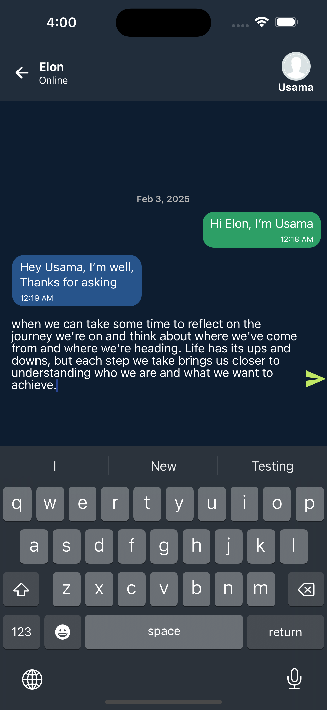

# Firebase Chat App


## Screenshots
<div style="display: flex; justify-content: space-between; gap: 10px;">
  
  
  
</div>

## Overview
This is a React Native chat application with Firebase & Microsoft authentication and real-time messaging.
## Features
### Authentication Screen
- Firebase authentication using email and password/Microsoft.
- Form validation with **Formik** and **Yup**.
- Authentication state management with **Redux Toolkit**.

### Messages List & Chat Screen
- Real-time chat with messages stored in **Firebase Realtime Database**.
- Messages include sender's name, text, and timestamp.
- "Typing indicator" when a user is typing.
- Messages appear in chronological order (latest at the bottom).
- Redux is used for state management.

## Setup Instructions
### Prerequisites
Ensure you have the following installed:
- **Node.js** (18+`)
- **npm** or **yarn**
- **Xcode 15.2 (15C500b)** (required for iOS development)
- **CocoaPods** (for managing iOS dependencies)

### Installation
1. Clone the repository:
   ```sh
   git clone <https://github.com/usamaalvi69/firebaseChatRN.git>
   cd firebaseChatRN
   ```

2. Install dependencies:
   ```sh
   yarn install
   ```

3. Install CocoaPods dependencies:
   ```sh
   cd ios
   pod install
   cd ..
   ```

### Firebase Setup
> **Note:** The `GoogleService-Info.plist` file has been pushed for ease, but ensure you update it if using your own Firebase project.

#### Linking `GoogleService-Info.plist` in Xcode
1. Open **Xcode** (`firebaseChatRN/ios/firebaseChatRN.xcworkspace`).
2. In the project navigator, right-click on the app target and select **Add Files to "firebaseChatRN"...**.
3. Select `GoogleService-Info.plist` from the project root.
4. Ensure **"Add to targets"** includes your app.
5. Save and close Xcode.

### Running the App on iOS
```sh
npx react-native run-ios
```
## Microsoft Authentication Setup

To enable Microsoft authentication using Firebase Authentication, follow these steps:

### 1. **Set up Microsoft Authentication in Firebase Console**:
   - Go to the [Firebase Console](https://console.firebase.google.com/).
   - Navigate to the **Authentication** section.
   - Under the **Sign-in method** tab, enable **Microsoft** as a sign-in provider.
   - **Application ID** is required to complete the setup. Make sure you add the correct **Application ID** in the provider's configuration on Firebase.

### 2. **Set up the Azure AD Tenant (if applicable)**:
   - If you're using Azure Active Directory, make sure to add the correct **Tenant ID** to the provider's configuration. This can be found in your Azure portal.

   > **Note**: Currently, Microsoft may not be allowing the registration of new applications through their portal. If you encounter this issue, ensure that you have access to an existing registered application or reach out to Microsoft support to resolve the issue.

### 3. **Update the Code with Microsoft Authentication in Login**:
   screens/Login:

   ```tsx
   const handleMicrosoftSignIn = async () => {
     try {
       const provider = new auth.OAuthProvider('microsoft.com');
       provider.addScope('offline_access');
       provider.setCustomParameters({
         prompt: 'consent',
         tenant: 'tenant_name_or_id', // Replace with your tenant ID
       });

       // Sign in with redirect
       await auth().signInWithRedirect(provider);
       console.log('Microsoft sign-in initiated');
     } catch (error: any) {
       Alert.alert('Error', error.message);
     }
   };

   ```
## Notes
- This project is currently set up for **iOS only**.
- The app uses Firebase for authentication and the Realtime Database to store registered users and chat messages.


